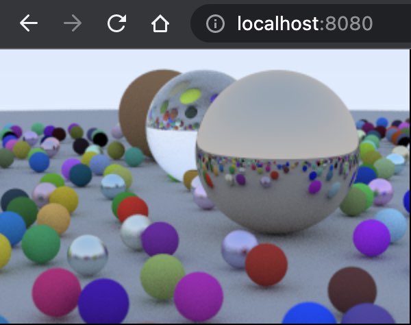

# Ray Tracing in One Weekend
------
Using minimalistic C and WebAssembly

<p align="center">

</p>
## Build & Run

```shell
npm i
npm start
```

Navigate to [localhost:8080](http://localhost:8080)

## Target goals

- Use pure C language
- No Emscripten
- No `stdlib`
- No heap allocations
- Compile to `wasm32` using clang
